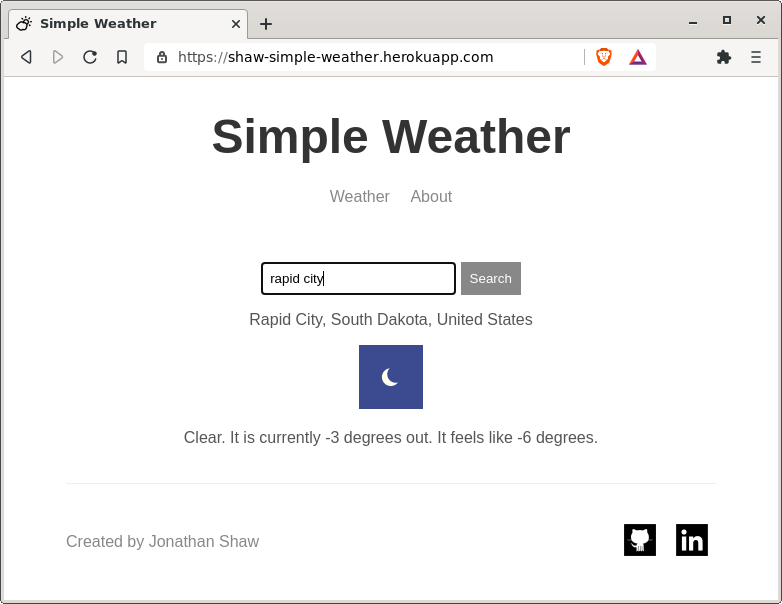

# Simple Weather

A very simple weather web application built for [Andrew Mead's Node.js Course on Udemy](https://www.udemy.com/course/the-complete-nodejs-developer-course-2).

This project allowed me to learn about APIs.  It uses the Mapbox API to resolve addresses to lat/long coordinates and the WeatherStack API to get the corresponding weather data.
